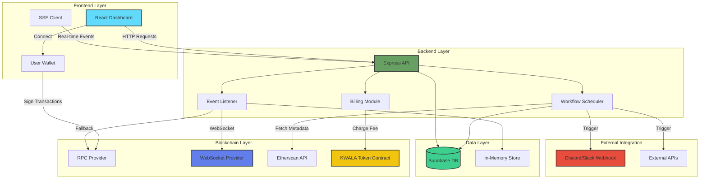

<div align="center">

# 🎯 KwalaFilter

### Real-Time EVM Event Listener & Workflow Automation Platform

[](https://opensource.org/licenses/MIT)
[](https://github.com/yourusername/kwalafilter)
[](https://nodejs.org/)
[](https://www.typescriptlang.org/)
[](https://reactjs.org/)
[](https://docs.ethers.org/)

**"Listen to the Chain. React in Real-Time."**

*Monitor smart contract events with sub-second latency, automatic catch-up, and powerful workflow automation across all EVM chains.*

[🚀 Quick Start](#-quick-start) • [📖 Documentation](#-documentation) • [✨ Features](#-features) • [🏗️ Architecture](#️-architecture)

</div>

---

## 🌟 Why KwalaFilter?

<table>
<tr>
<td width="33%" align="center">
<h3>⚡ Lightning Fast</h3>
<p>Sub-second event delivery via WebSocket & SSE streaming</p>
</td>
<td width="33%" align="center">
<h3>🔄 Never Miss a Beat</h3>
<p>Automatic historical catch-up from last processed block</p>
</td>
<td width="33%" align="center">
<h3>🤖 Automate Everything</h3>
<p>Trigger webhooks, APIs, and custom workflows on-chain events</p>
</td>
</tr>
</table>

---

## ✨ Features

### Core Capabilities

- 🎯 **Real-Time Event Streaming** - WebSocket and Server-Sent Events (SSE) for instant notifications
- 📜 **Historical Log Catch-Up** - Automatically fetches missed events after downtime
- 🔔 **Workflow Automation** - Trigger webhooks, Discord notifications, or API calls on specific events
- 🌐 **Multi-Chain Support** - Ethereum, Polygon, Arbitrum, Optimism, Base, and any EVM-compatible chain
- 🎨 **Beautiful Dashboard** - Modern dark-themed UI with real-time log visualization
- 🔍 **Event Decoding** - Automatic ABI-based log parsing and formatting
- 💾 **Persistent Subscriptions** - Save configurations to database for long-term monitoring
- 📊 **Workflow Analytics** - Track execution history and success rates

### Developer Experience

- 🛠️ **Easy Setup** - Get started in under 5 minutes
- 📝 **TypeScript Support** - Full type safety with Zod validation
- 🔌 **RESTful API** - Simple HTTP endpoints for integration
- 📚 **Comprehensive Docs** - API reference, setup guides, and examples
- 🎭 **Shadcn UI Components** - Beautiful, accessible, and customizable

---

## 🏗️ Architecture



---

## 🚀 Quick Start

### Prerequisites

- **Node.js** v18 or higher
- **RPC Provider** (Alchemy, Infura, QuickNode, etc.)
- **Supabase Account** (optional, for workflow persistence)

### Installation

```bash
# Clone the repository
git clone https://github.com/yourusername/kwalafilter.git
cd kwalafilter

# Install dependencies
npm install

# Configure environment variables
cp .env.example .env
# Edit .env with your RPC URLs and API keys

# Start the development server
npm run dev
```

🎉 **That's it!** Open `http://localhost:5000` to see your dashboard.

---

## 🛠️ Tech Stack

<div align="center">

### Frontend


### Backend


### Blockchain & Data


</div>

---

## 📂 Project Structure

```
KwalaFilter/
├── 📱 client/                    # React Frontend Application
│   ├── src/
│   │   ├── components/          # Reusable UI Components (51 items)
│   │   │   ├── ui/              # Shadcn UI Components
│   │   │   └── landing/         # Landing Page Components
│   │   ├── pages/               # Route Pages
│   │   │   ├── event-listener.tsx   # Main Dashboard (940 lines)
│   │   │   ├── workflow.tsx         # Workflow Management
│   │   │   └── Documentation.tsx    # API Documentation
│   │   ├── hooks/               # Custom React Hooks
│   │   └── lib/                 # Utilities & Helpers
│   └── index.css                # Global Styles (11KB)
│
├── 🔧 server/                    # Express Backend
│   ├── app.ts                   # Express App Configuration
│   ├── routes.ts                # API Route Handlers (292 lines)
│   ├── scheduler.ts             # Workflow Automation Engine (286 lines)
│   ├── listeners/               # Blockchain Event Listeners
│   │   ├── logListener.js       # Core Event Listener (805 lines)
│   │   ├── getBlockNumber.js    # Block Number Fetching
│   │   └── etherscanService.js  # Etherscan Integration
│   └── storage/                 # Data Access Layer
│       └── getAllContractsBlockNumber.js
│
├── 🔗 shared/                    # Shared Types & Schemas
│   ├── schema.ts                # Zod Validation Schemas
│   └── getAllDataForCheckingLogs.ts
│
├── 📚 docs/                      # Documentation
│   ├── API.md                   # API Reference
│   ├── BACKEND_SETUP.md         # Configuration Guide
│   └── design_guidelines.md     # UI/UX Standards
│
├── ⚙️ Configuration Files
│   ├── package.json             # Dependencies & Scripts
│   ├── tsconfig.json            # TypeScript Config
│   ├── vite.config.ts           # Vite Build Config
│   ├── tailwind.config.ts       # Tailwind Customization
│   └── drizzle.config.ts        # Database ORM Config
│
└── 🌍 Environment
    ├── .env.example             # Environment Template
    └── .env                     # Your Configuration (gitignored)
```

---

## 📖 Documentation

| Document | Description |
|----------|-------------|
| [📡 API Reference](docs/API.md) | Complete API endpoint documentation with examples |
| [⚙️ Backend Setup](BACKEND_SETUP.md) | Environment configuration and deployment guide |
| [🎨 Design Guidelines](design_guidelines.md) | UI/UX standards and component library |

---

## 🎯 Use Cases

### DeFi Monitoring
```javascript
// Track large Uniswap swaps
Contract: 0x88e6A0c2dDD26FEEb64F039a2c41296FcB3f5640 (USDC/ETH Pool)
Event: Swap
Trigger: When amount > $100,000 → Notify Discord
```

### NFT Tracking
```javascript
// Monitor new NFT mints
Contract: 0xBC4CA0EdA7647A8aB7C2061c2E118A18a936f13D (BAYC)
Event: Transfer
Trigger: When from == 0x0 → Log to database
```

### Governance Alerts
```javascript
// Track DAO proposals
Contract: 0x5e4be8Bc9637f0EAA1A755019e06A68ce081D58F (Uniswap Governance)
Event: ProposalCreated
Trigger: New proposal → Send email notification
```

### Security Monitoring
```javascript
// Detect suspicious transfers
Contract: Your Token Contract
Event: Transfer
Trigger: When value > 1M tokens → Alert security team
```

---

## 🚦 Getting Started Guide

### 1️⃣ Configure Your Environment

Create a `.env` file with your credentials:

```env
# Blockchain RPC Endpoints
RPC_URL=https://eth-mainnet.g.alchemy.com/v2/YOUR_API_KEY
RPC_WS_URL=wss://eth-mainnet.g.alchemy.com/v2/YOUR_API_KEY

# Etherscan API (for contract metadata)
ETHERSCAN_API_KEY=YOUR_ETHERSCAN_KEY

# Supabase Database (for workflow persistence)
SUPABASE_URL=https://your-project.supabase.co
SUPABASE_SERVICE_ROLE_KEY=your_service_role_key

# Server Configuration
PORT=5000
NODE_ENV=development
```

### 2️⃣ Start Monitoring Events

1. Navigate to `http://localhost:5000/dashboard`
2. Enter contract address (e.g., USDC: `0xA0b86991c6218b36c1d19D4a2e9Eb0cE3606eB48`)
3. Enter event signature hash (e.g., Transfer: `0xddf252ad1be2c89b69c2b068fc378daa952ba7f163c4a11628f55a4df523b3ef`)
4. Paste contract ABI (get from Etherscan)
5. Click **Start Listening** 🎧

### 3️⃣ Set Up Workflows (Optional)

1. Configure webhook URL (Discord, Slack, custom API)
2. Define dynamic parameters using `${re.event(0)}` syntax
3. Click **Save to Database**
4. Scheduler will automatically trigger on new events

---

## 🎨 Screenshots

<div align="center">

### Dashboard View
*Real-time event monitoring with beautiful dark theme*

### Workflow Configuration
*Set up automated actions with visual feedback*

### Live Event Stream
*Decoded events with transaction links and timestamps*

</div>

---

## 🔧 API Endpoints

### Event Listening
```http
GET /listen?address=0x...&topic0=0x...&abi=base64_encoded_abi
```
Establishes SSE connection for real-time event streaming.

### Subscription Management
```http
POST /api/subscriptions
Content-Type: application/json

{
  "address": "0x...",
  "topic0": "0x...",
  "abi": [...],
  "ActionName": "Notify Discord",
  "api": "https://discord.com/api/webhooks/..."
}
```

### Workflow History
```http
GET /api/workflows
```
Returns execution history of all workflows.

### Health Check
```http
GET /health
```
Server status and active subscription count.

📚 **[Full API Documentation →](docs/API.md)**

---

## 🌐 Supported Chains

| Chain | Chain ID | Status |
|-------|----------|--------|
| Ethereum Mainnet | 1 | ✅ Supported |
| Polygon | 137 | ✅ Supported |
| Arbitrum One | 42161 | ✅ Supported |
| Optimism | 10 | ✅ Supported |
| Base | 8453 | ✅ Supported |
| Avalanche C-Chain | 43114 | ✅ Supported |
| BNB Smart Chain | 56 | ✅ Supported |
| *Any EVM Chain* | * | ✅ Supported |

> Just configure your RPC URL for any EVM-compatible chain!

---

## 🤝 Contributing

We welcome contributions! Here's how you can help:

1. 🍴 Fork the repository
2. 🌿 Create a feature branch (`git checkout -b feature/amazing-feature`)
3. 💾 Commit your changes (`git commit -m 'Add amazing feature'`)
4. 📤 Push to the branch (`git push origin feature/amazing-feature`)
5. 🎉 Open a Pull Request

### Development Setup

```bash
# Install dependencies
npm install

# Run development server with hot reload
npm run dev

# Type checking
npm run check

# Build for production
npm run build

# Start production server
npm start
```

---

## 📊 Project Stats

- **Lines of Code**: ~3,000+ (TypeScript/JavaScript)
- **Components**: 51 React components
- **API Endpoints**: 4 core endpoints
- **Dependencies**: 60+ npm packages
- **Supported Chains**: All EVM-compatible networks

---

## 🗺️ Roadmap

- [x] Real-time event streaming
- [x] Historical log catch-up
- [x] Workflow automation
- [x] Multi-chain support
- [ ] **Authentication & API keys**
- [ ] **Advanced filtering & search**
- [ ] **Multi-step workflows**
- [ ] **GraphQL API**
- [ ] **JavaScript SDK**
- [ ] **CLI tool**
- [ ] **Mobile app**

---

## 📄 License

This project is licensed under the **MIT License** - see the [LICENSE](LICENSE) file for details.

---

## 🙏 Acknowledgments

Built with amazing open-source technologies:
- [Ethers.js](https://docs.ethers.org/) - Ethereum library
- [React](https://reactjs.org/) - UI framework
- [Shadcn UI](https://ui.shadcn.com/) - Component library
- [Supabase](https://supabase.com/) - Backend as a Service
- [Tailwind CSS](https://tailwindcss.com/) - Styling framework

---

<div align="center">

### 💫 Star this repo if you find it useful!

**Made with ❤️ by blockchain developers, for blockchain developers**

[⬆ Back to Top](#-kwalafilter)

</div>
