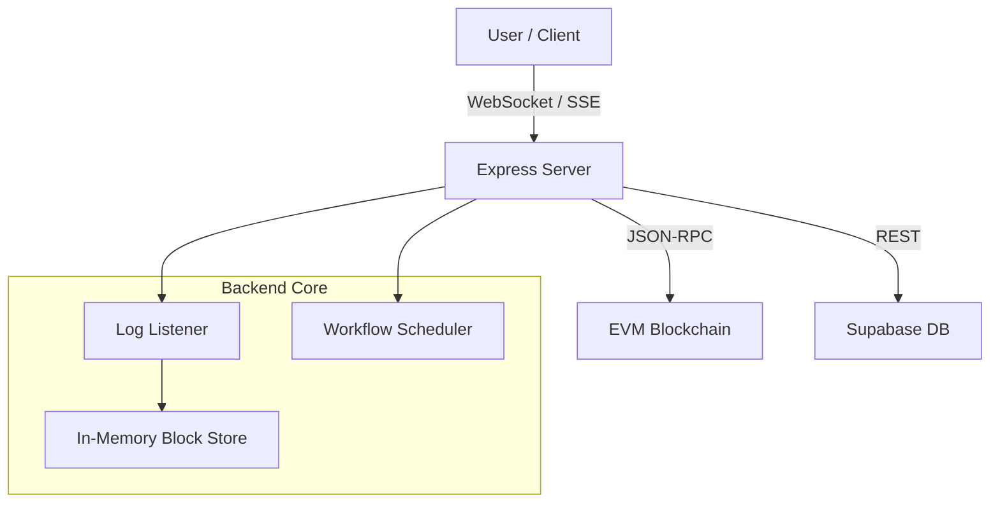

# KwalaFilter: Real-Time EVM Event Listener Platform


> **"Listen to the Chain. React in Real-Time."**

KwalaFilter is a high-performance blockchain monitoring tool designed for developers who need to track smart contract events instantly. It streams logs via WebSocket/SSE, catches up on historical data automatically, and triggers automated workflows.

## 🏗️ Architecture



## 🚀 Key Features

- **⚡ Real-Time Streaming**: Sub-second latency event delivery using WebSocket and Server-Sent Events (SSE).
- **Rewind & Catch-Up**: Automatically fetches missed logs from the last processed block after downtime.
- **🤖 Workflow Automation**: Trigger webhooks or database updates when specific events (like `Transfer` or `Swap`) occur.
- **🔍 Multi-Chain Ready**: Compatible with Ethereum, Polygon, Arbitrum, Optimism, and any EVM-compatible chain.
- **💎 Modern Dashboard**: A beautiful, dark-themed UI for managing listeners and viewing live logs.

## 🛠️ Tech Stack

- **Frontend**: React, Vite, Tailwind CSS, Framer Motion, Shadcn UI
- **Backend**: Node.js, Express, Socket.IO
- **Blockchain**: Ethers.js v6
- **Database**: Supabase (PostgreSQL)

## 🏁 Quick Start

### Prerequisites
- Node.js v18+
- An Ethereum RPC URL (Alchemy, Infura, etc.)
- A Supabase project (optional, for workflows)

### Installation

1. **Clone the repository**
   ```bash
   git clone https://github.com/yourusername/kwalafilter.git
   cd kwalafilter
   ```

2. **Install dependencies**
   ```bash
   npm install
   ```

3. **Configure Environment**
   Copy `.env.example` to `.env` and fill in your details:
   ```bash
   cp .env.example .env
   ```
   *See [Backend Setup](BACKEND_SETUP.md) for detailed configuration.*

4. **Run the Application**
   ```bash
   npm run dev
   ```
   The server will start on port `5000`.
   - **Landing Page**: `http://localhost:5000`
   - **Dashboard**: `http://localhost:5000/dashboard`

## 📂 Project Structure

```
KwalaFilter/
├── client/                 # React Frontend
│   ├── src/components/     # UI Components (Landing, Dashboard)
│   └── src/pages/          # Route Pages
├── server/                 # Express Backend
│   ├── listeners/          # Blockchain Event Listeners
│   ├── storage/            # Data Access Layer
│   └── scheduler.ts        # Workflow Automation Engine
├── shared/                 # Shared Types & Schemas
└── docs/                   # Detailed Documentation
```

## 📚 Documentation

- [API Reference](docs/API.md) - Detailed API endpoints.
- [Backend Setup](BACKEND_SETUP.md) - Configuration guide.
- [Design Guidelines](design_guidelines.md) - UI/UX standards.

## 🤝 Contributing

Contributions are welcome! Please feel free to submit a Pull Request.

## 📄 License

This project is licensed under the MIT License.
